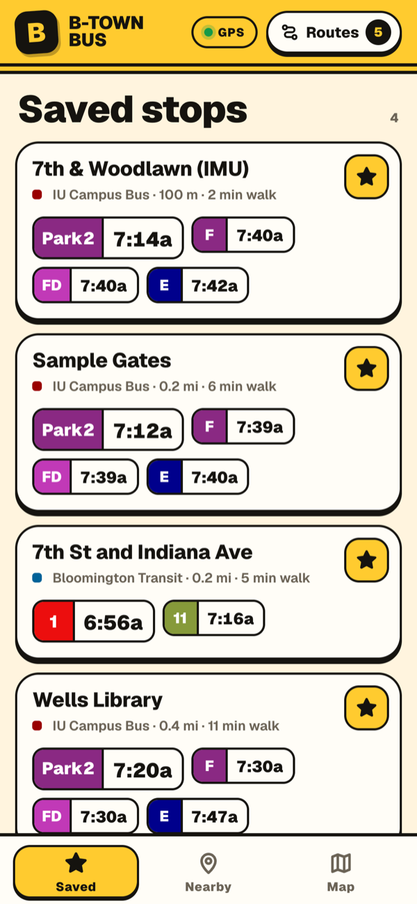
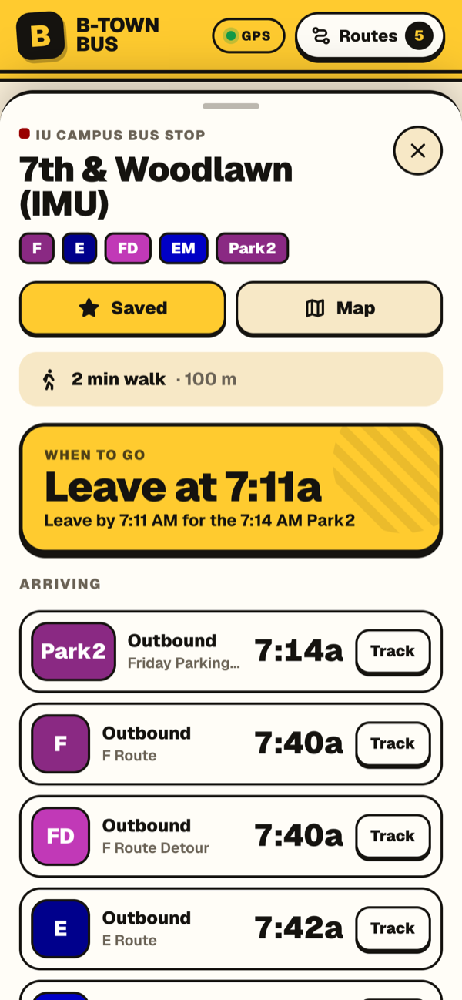
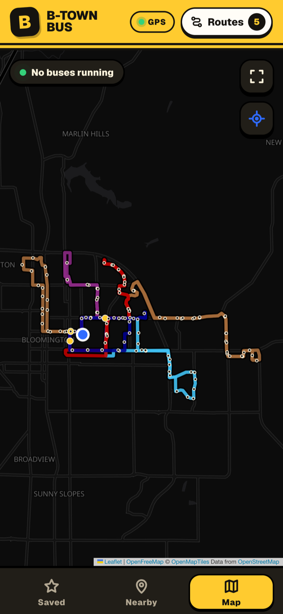
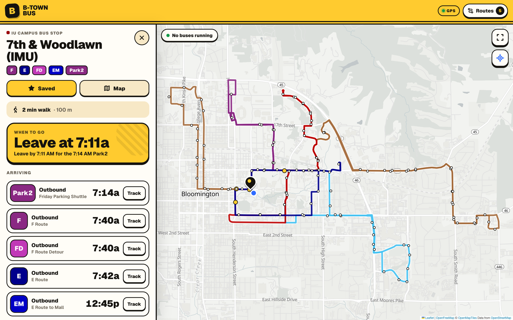
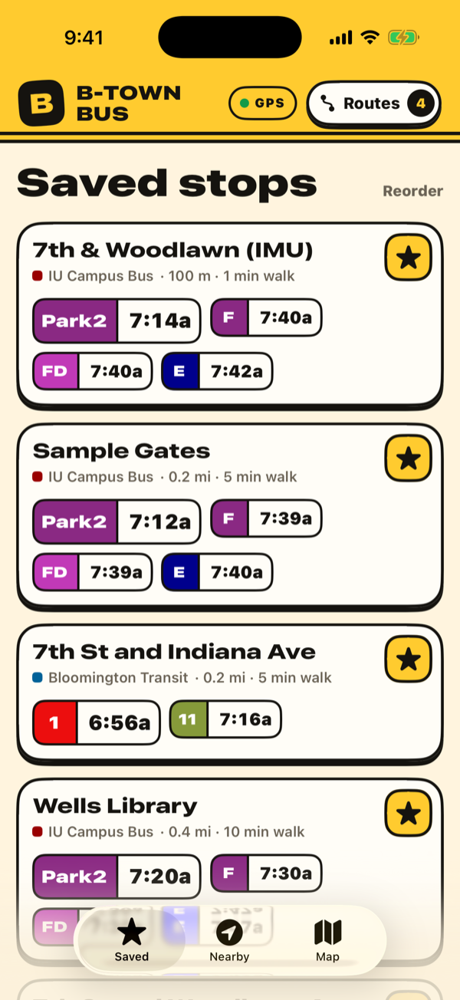
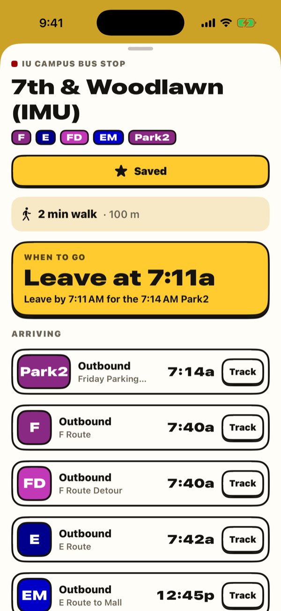
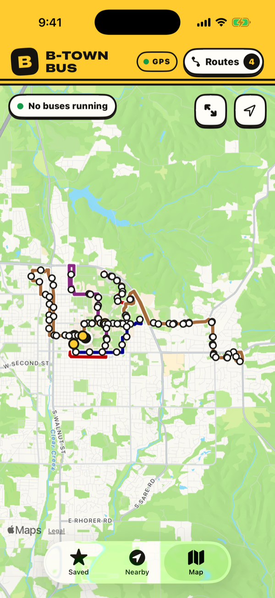
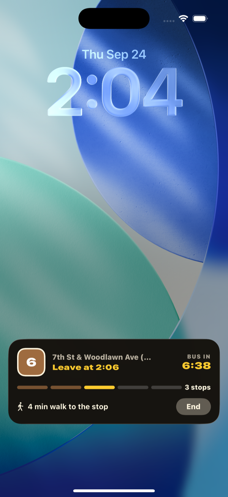

# B-Town Bus

A bus tracker for Bloomington that puts Bloomington Transit and IU Campus Bus on the same map. I built it because I got tired of switching between two apps to figure out which bus was actually coming first.

It's live at **[btb.singhdan.me](https://btb.singhdan.me)**. No account, no API key. There's also a native iPhone app in [`ios/`](ios/) with a Live Activity that follows your bus to your stop.

<table>
  <tr>
    <td></td>
    <td></td>
    <td></td>
  </tr>
</table>



## How I use it

Pick the routes you actually ride under **Routes**. Star the stops you use and they show up on the **Saved** tab with the next few buses, so opening the app is usually all it takes. **Nearby** lists the closest stops to wherever you are, and **Map** shows the routes and live bus positions.

Tap a stop to see every bus headed there, how many stops away each one is, how long the walk is, and when you'd need to leave. If you're already standing at the stop, it says so and stops telling you to leave. Hit **Track** on a bus and it stays pinned to the bottom of the screen until it shows up.

To put it on your home screen on an iPhone, open it in Safari and use Share → Add to Home Screen. Safari may still ask for location once each time you launch it from the home screen. That's a Safari thing, not something the site can turn off, and it's one of the reasons the native app exists.

## iPhone app

<table>
  <tr>
    <td></td>
    <td></td>
    <td></td>
    <td></td>
  </tr>
</table>

Same idea as the site, written in SwiftUI. The part I care about most is tracking: pick a bus, say how many stops out you want to hear about it (5 by default), and a Live Activity shows up on the Lock Screen and Dynamic Island with the countdown, stops remaining, your walk time, and when to leave. It buzzes when it's time to go and again when the bus is pulling up, then clears itself once the bus has passed.

Build instructions and the fine print about background tracking are in [ios/README.md](ios/README.md).

## About the numbers

Arrival times come straight from the agencies' ETA Spot feeds; nothing is guessed from bus speed. Buses refresh every 15 seconds and arrivals every 20 while the page is open. If one agency's feed goes down, the other keeps working.

Walk times are rough. On the web it's straight-line distance plus 25%, at 1.3 m/s. The iPhone app asks Apple Maps for real walking directions. "Leave by" adds a minute so you're not sprinting. You count as being at a stop within about 40 m, plus some slack for GPS error.

Your routes, saved stops, and tracked bus are stored on your device only.

This is a personal project. It isn't affiliated with Bloomington Transit or Indiana University, and predictions can be wrong, so don't blame me if the 6 is late.

## Running it yourself

You need Node 22.13 or newer.

```sh
npm ci
npm run dev
```

Then open localhost:3000. There's no backend: the browser talks to the transit feeds and map tiles directly.

```sh
npm test               # polling, freshness, and trip math
npm run lint
npm run build          # static export to out/
npm run validate:live  # pings the real feeds
```

Pushes to `main` deploy to GitHub Pages through [the workflow](.github/workflows/pages.yml). If you fork it, change or delete `public/CNAME` and the URL in `app/layout.tsx`. The site assumes it's served from the root of a domain.

## Where things live

- `app/page.tsx` has the three views, polling, favorites, and trip tracking.
- `app/components/` has the stop cards, stop sheet, trip card, route picker, and the Leaflet/MapLibre map.
- `app/hooks/useLiveLocation.ts` keeps one location watch alive and restarts it when it goes stale.
- `src/transit/` is the feed client, polling, and `trip.ts`, which holds the stops-away, walk, and leave-time rules. The iOS app ports the same rules.
- `ios/` is the SwiftUI app and its Live Activity widget.
- `fixtures/` holds saved feed responses for reference. The app doesn't read them.

## License

MIT, see [LICENSE](LICENSE). That covers my code. Transit data, map data, and map tiles belong to their providers and keep their own terms.
