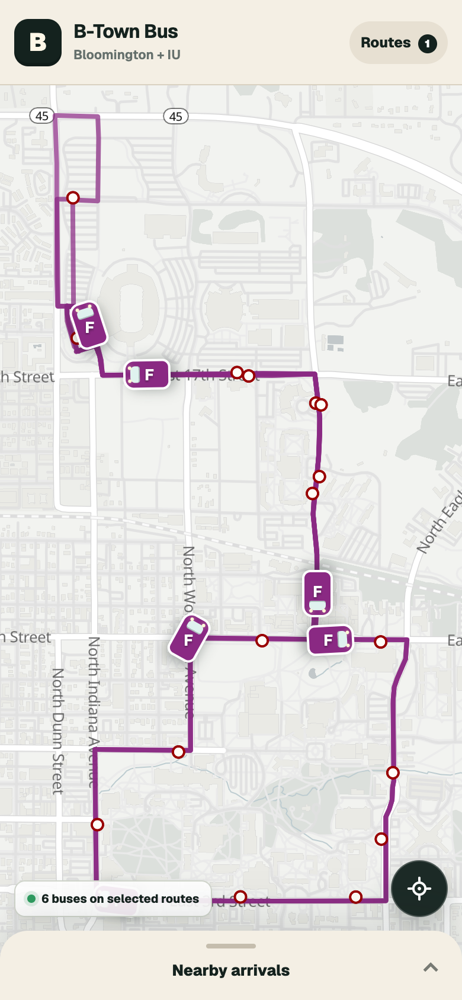
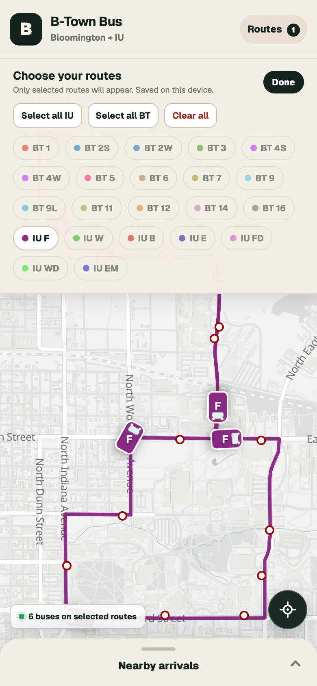
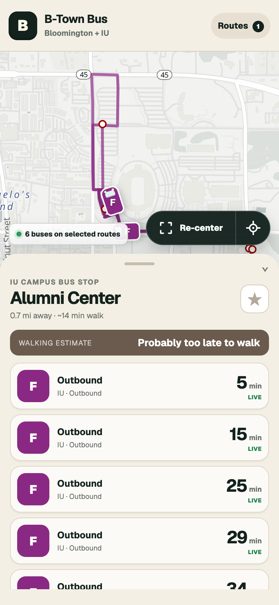
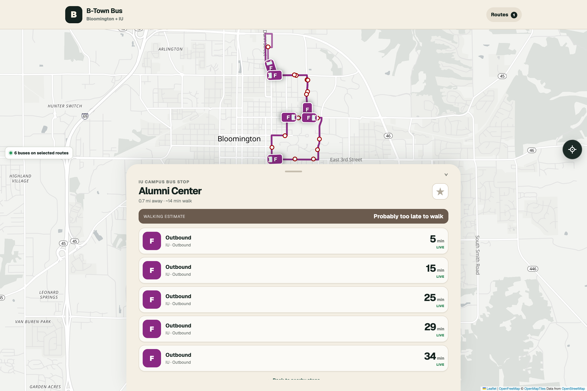

# B-Town Bus

Bloomington Transit and IU Campus Bus on one map. Pick your routes, see where the buses are, and tap a stop for arrival times.

**[Open B-Town Bus](https://btb.singhdan.me)** — no account or API key needed.

## On your phone

<p>
  
  
  
</p>

Screenshots from the app running at a 390 × 844 mobile viewport, using public feeds on September 8, 2026. Bus positions and arrival times change throughout the day.

1. Open **Routes** and choose the routes you use. Your choices are saved on that device.
2. Tap the location button to find stops near you, or browse the map. Without location access, nearby arrivals use downtown Bloomington as the starting point.
3. Tap a stop for its arrivals and walking estimate. Collapse the arrivals panel to see more of the map; use **Re-center** to fit your selected routes.

On iPhone or iPad, open the app in Safari and use **Share → Add to Home Screen**. Browsers that support an install prompt can also show an **Install** button.

<details>
<summary>Desktop screenshot</summary>



</details>

## What the times mean

Arrival predictions come from the transit feeds. Walking estimates use straight-line distance and an assumed walking speed; they do not account for sidewalks, crossings, or detours. Treat them as a rough guide.

While the page is visible, the app checks vehicles every 15 seconds and arrivals every 25 seconds after each request finishes. Failed polls back off to at most 60 seconds; a working provider keeps updating during a partial outage. Requests time out after 10 seconds. Freshness labels update with the app clock every 15 seconds, using a 90-second cutoff for “live”.

Route selections and starred stops are stored in your browser. The service worker caches the app shell and same-origin assets, but live transit responses are not cached for offline use. Current arrivals and map tiles need a network connection.

This is an independent project, not affiliated with Bloomington Transit or Indiana University.

## Run locally

Requires **Node.js 22.13 or newer** and npm. CI uses Node.js 24.

```sh
npm ci
npm run dev
```

Open [localhost:3000](http://localhost:3000). No environment variables, database, or backend service are needed for the standard Next.js build. The browser connects to the public transit feeds and map services directly.

```sh
npm test               # Polling and freshness regression tests
npm run lint           # ESLint
npm run build          # Type-check and export the static site to out/
npm start              # Serve out/ after building
npm run validate:live  # Check upstream feeds and browser CORS support
```

The live-feed check contacts the providers directly; it does not need a running dev server and is not a substitute for testing the UI. `npm start` uses `npx serve`, which may download the server on first use.

## How it fits together

| Path | Purpose |
| --- | --- |
| `app/page.tsx` | Route selection, polling, location, stop arrivals, and walking estimates |
| `app/components/TransitMap.tsx` | Leaflet interactions and MapLibre rendering of the basemap, routes, and stops |
| `src/transit/client.ts` | Validates ETA Spot responses with Zod and normalizes both agencies into shared types |
| `src/transit/polling.ts` | Serial polling, visibility checks, and bounded retry delays |
| `src/transit/types.ts` | Shared route, stop, vehicle, and arrival types |
| `app/components/InstallSupport.tsx`, `public/sw.js` | Home-screen installation and app-shell caching |
| `scripts/prepare-maplibre.mjs` | Copies MapLibre worker files into `public/` before development and builds |
| `fixtures/` | Captured public feeds for reference; not a runtime data source |

Both agencies use ETA Spot: [Bloomington Transit](https://bloomingtontransit.etaspot.net/service.php?service=get_routes) and [IU Campus Bus](https://iucbs.etaspot.net/service.php?service=get_routes). The basemap uses OpenFreeMap, OpenMapTiles, and OpenStreetMap data; attribution is shown on the map.

## Deployment

[The Pages workflow](.github/workflows/pages.yml) builds pushes to `main` and publishes `out/` to GitHub Pages. It can also be run manually. There is no production application server.

For your own deployment, configure GitHub Pages to use GitHub Actions and update or remove `public/CNAME`. Update the production URL in `app/layout.tsx` as well. The current service worker and asset paths assume hosting at the domain root; a project URL under `/repository-name/` needs path configuration changes.

The repository also retains a separate Sites/Vite preview configuration in `vite.config.ts` and `.openai/hosting.json`. The npm development/build scripts and Pages workflow use Next.js. Keep that distinction in mind before removing preview dependencies.

## Contributing

For a bug report, include your browser, the route and stop, the approximate time, and what you expected to see. For code changes, run the tests, lint, and the production build, then check route selection and stop arrivals at a phone-sized viewport. Live feeds can be empty outside service hours.

## License

The application code and original documentation are available under the [MIT License](LICENSE). Transit feed fixtures, map data, and third-party assets retain their respective owners’ terms; the MIT license does not relicense them.
